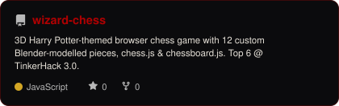

<div align="center">

# BLESSY MOL CHARLS

### `COMPUTER SCIENCE × AI × MAGIC`


<br>


<br><br>

[](https://github.com/Blessymolcharls)
[](https://linkedin.com/in/blessy-mol-charls)
[](mailto:blessymolcharls@gmail.com)

<br>

*“I solemnly swear that I am up to no good.”*

</div>

---

## `THE SORTING HAT`

```text
╭──────────────────────────────────────────────────────────────╮
│                                                              │
│  NAME              Blessy Mol Charls                         │
│  HOUSE             Ravenclaw                                 │
│  SPECIALIZATION    Computer Science × AI                     │
│  CGPA              8.97 / 10                                 │
│  CURRENT QUEST     Building things that start with           │
│                    "wait — what if we tried this?"           │
│  WEAKNESS          Adding one more feature                   │
│  STATUS            Mischief: ACTIVE                          │
│                                                              │
╰──────────────────────────────────────────────────────────────╯
```

B.Tech Computer Science & Engineering with an AI specialisation.
I build full-stack systems, IoT devices, and occasionally gesturally-controlled wizard battles using a webcam.

My projects tend to start as "this is a sensible engineering idea" and end somewhere between
"this probably shouldn't exist" and "let's present this at a hackathon."
I like it here.

---

## `THE SPELLBOOK`

<div align="center">


</div>

<br>

| Discipline | Muggle Translation |
|---|---|
| `CHARMS` | C · C++ · Java · Python · JavaScript · Dart |
| `TRANSFIGURATION` | Node.js · Express.js · Flutter · Flask · Java Swing |
| `POTIONS` | MySQL · MariaDB · Hive · JDBC |
| `DIVINATION` | AI · Machine Learning · Computer Vision · MediaPipe |
| `MUGGLE ENGINEERING` | ESP32 · BLE · IoT · Arduino · CGI |
| `ANCIENT RUNES` | DSA · Algorithms · Computer Architecture · gem5 |
| `ARTIFICIAL MAGIC` | Blender · Figma · Canva · pandas · Matplotlib |


---

## `THE ROOM OF REQUIREMENT`

*You never know what you'll find in here.*

<br>

<div align="center">

<!-- Wizard Chess — centrepiece -->
<picture>
  <source media="(prefers-color-scheme: dark)"  srcset="assets/card-wizard-chess-dark.svg">
  <source media="(prefers-color-scheme: light)" srcset="assets/card-wizard-chess-light.svg">
  
</picture>

<br><br>

**01 — WIZARD CHESS**

Bringing Hogwarts chess battles to life in the browser.

Integrated **12 custom Harry Potter-themed 3D chess pieces** (modelled from scratch in Blender)
into an interactive browser-based chessboard using chess.js and chessboard.js.
Top 6 at College &amp; Top 200 Overall at TinkerHack 3.0.

`JavaScript` · `chess.js` · `chessboard.js` · `Blender` · `3D Modeling`

<br>

---

<table>
<tr>
<td width="50%" align="center">

<a href="https://github.com/Blessymolcharls/wizards-duel">
<picture>
  <source media="(prefers-color-scheme: dark)"  srcset="assets/card-wizards-duel-dark.svg">
  <source media="(prefers-color-scheme: light)" srcset="assets/card-wizards-duel-light.svg">
  
</picture>
</a>

**02 — WIZARDS DUEL**

Turning hand gestures into wizard battles — because using a mouse wasn't dramatic enough.

`Python` · `MediaPipe` · `Computer Vision`

</td>
<td width="50%" align="center">

<a href="https://github.com/Blessymolcharls/StudySync">
<picture>
  <source media="(prefers-color-scheme: dark)"  srcset="assets/card-StudySync-dark.svg">
  <source media="(prefers-color-scheme: light)" srcset="assets/card-StudySync-light.svg">
  
</picture>
</a>

**03 — STUDYSYNC**

Role-based study management desktop app. Task scheduling, PDF sharing, team access.
Led a 4-member team.

`Java` · `Java Swing` · `JDBC` · `MariaDB`

</td>
</tr>
<tr>
<td width="50%" align="center">

<a href="https://github.com/Blessymolcharls/VendorVerse">
<picture>
  <source media="(prefers-color-scheme: dark)"  srcset="assets/card-VendorVerse-dark.svg">
  <source media="(prefers-color-scheme: light)" srcset="assets/card-VendorVerse-light.svg">
  
</picture>
</a>

**04 — VENDORVERSE**

Full-stack vendor management platform. REST APIs, authentication, dynamic data rendering.

`JavaScript` · `Node.js` · `Express.js`

</td>
<td width="50%" align="center">

*More in the vault.*

[View all repositories →](https://github.com/Blessymolcharls?tab=repositories)

</td>
</tr>
</table>

</div>

---

## `THE DAILY PROPHET`

<div align="center">

<picture>
  <source media="(prefers-color-scheme: dark)"  srcset="assets/card-stats-dark.svg">
  <source media="(prefers-color-scheme: light)" srcset="assets/card-stats-light.svg">
  
</picture>

</div>

---

## `THE BASILISK`

*You probably shouldn't have opened this.*

<div align="center">

<picture>
  <source media="(prefers-color-scheme: dark)"  srcset="https://raw.githubusercontent.com/Blessymolcharls/Blessymolcharls/output/snake-dark.svg">
  <source media="(prefers-color-scheme: light)" srcset="https://raw.githubusercontent.com/Blessymolcharls/Blessymolcharls/output/snake.svg">
  
</picture>

</div>

---

<div align="center">

<br>

*⚡ — 🪄 — 💻*

<br>

*“Mischief managed.”*

<br>

</div>